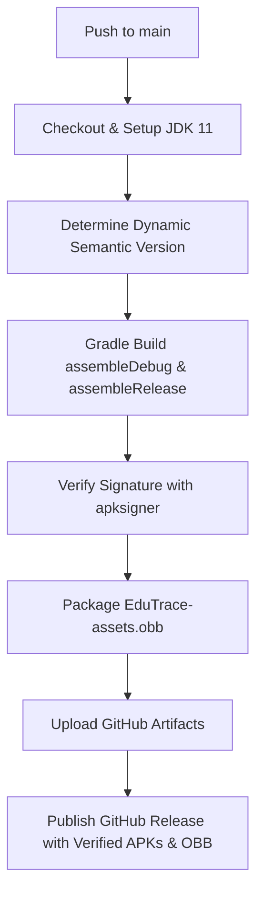

<div align="center">

# 🎓 EduTrace
### Modern Study Tracker, Focus Assistant & Productivity Companion for Android

[](https://github.com/sabbir28/EduTrace/actions/workflows/android_build.yml)
[](https://github.com/sabbir28/EduTrace/releases/latest)
[-10B981)](https://developer.android.com)
[](LICENSE)

*EduTrace is a modern, privacy-respecting Android application built to help students, developers, and lifelong learners master their study habits, eliminate digital distractions, and reach deep focus states.*

[📥 **Download Latest APK**](https://github.com/sabbir28/EduTrace/releases/latest) • [📖 **Features**](#-features) • [📦 **OBB Expansion System**](#-ota-obb-asset-pack-system) • [⚙️ **Architecture**](#-project-architecture)

---

</div>

## ✨ Features

### ⏱️ Intelligent Focus Timer
- **Real-Time Session Tracking**: High-precision stopwatch tracking net study time, break duration, and distraction counts.
- **Session Persistence**: Powered by `SessionManager` so your active study timer survives app restarts, background kills, and phone reboots.
- **Micro-Animations & Haptics**: Smooth transitions with haptic feedback on break, distraction, and session milestones.

### 🎓 Degree & Subject Hierarchy
- **Structured Learning**: Group subjects into academic degrees (e.g. BSc in Computer Science, IELTS, Board Exams).
- **Custom Goals & Colors**: Color-coded subjects with custom target study hours and progress visualization.
- **Local Database (Room)**: 100% offline-first architecture with AndroidX Room SQLite database.

### 📊 Deep Analytics & Intelligence
- **Study Pulse Engine**: Aggregates total hours, distraction frequency, and focus ratios.
- **Visual Reports**: View historical trends across daily, weekly, and subject-specific intervals.
- **Focus Score Calculation**: Measures efficiency based on net productive study time versus break and distraction intervals.

### 🚀 Built-in GitHub In-App Auto-Update
- **Zero-Friction Updates**: Automatically checks for new versions published on GitHub Releases upon app startup.
- **One-Tap Download**: Uses Android's native `DownloadManager` to download verified release packages with progress in your notification drawer.
- **Manual Check in Settings**: Check for new releases anytime from **Settings &rarr; App Updates**.

### 📦 OTA OBB Asset Pack Expansion System
- **Hot-Update Content Without Reinstalling**: Update study quotes, ambient soundscapes, and syllabus templates over-the-air!
- **Zero App Reinstalls**: When new content is published, existing users simply download the lightweight `.obb` pack instead of reinstalling the entire APK.
- **Automatic Fallback**: If an OBB expansion pack is not yet downloaded, EduTrace automatically uses its bundled local assets.

### 🛡️ Digital Wellbeing & Library Mode
- **Automatic Library Mode**: Automatically silences notifications, ringers, and media during active study intervals.
- **App Usage Warden**: Monitors device usage during focus hours and provides overlay nudges to prevent social media doom-scrolling.

### 🌐 Bilingual Experience & Custom Typography
- **Language Support**: Seamlessly switch between **English** and **বাংলা (Bengali)** with instant UI refresh.
- **Curated Typography**: Integrated with custom typefaces including *Chillax* and *Li Chhatrish July* for a clean, distraction-free aesthetic.

---

## 📱 Installation & Downloads

### Option 1: Direct Download (Recommended)
You can always grab the latest verified APK directly from the [GitHub Releases](https://github.com/sabbir28/EduTrace/releases/latest) page:

| Package | Recommended For | Direct Link |
| :--- | :--- | :--- |
| **`EduTrace-release.apk`** | General use (Signed with Android debug certificate) | [Download Release APK](https://github.com/sabbir28/EduTrace/releases/latest/download/EduTrace-release.apk) |
| **`EduTrace-debug.apk`** | Developers & testing | [Download Debug APK](https://github.com/sabbir28/EduTrace/releases/latest/download/EduTrace-debug.apk) |
| **`EduTrace-assets.obb`** | Content & soundscape expansion pack | [Download Asset Pack](https://github.com/sabbir28/EduTrace/releases/latest/download/EduTrace-assets.obb) |

### Installation Instructions:
1. Download either **`EduTrace-release.apk`** or **`EduTrace-debug.apk`** to your phone.
2. Tap the downloaded file in your browser or Downloads folder.
3. If prompted to allow installs from this source, enable **"Allow from this source"**.
4. If **Google Play Protect** displays a warning for the self-signed certificate, tap **"More details" &rarr; "Install anyway"**.
> [!TIP]
> If Android ever shows *"App not installed"*, uninstall any previous test version on your device first, as Android security blocks installing updates if the previous package was signed with a different key.

---

## 📦 OTA OBB Asset Pack System

EduTrace includes a modular **Opaque Binary Blob (OBB)** asset expansion pack manager (`ObbManager`):

```
EduTrace/
├── App APK (UI, Logic, Services)
└── main.edutrace.obb (Dynamic Content Pack)
    ├── quotes_en.json (Motivational quotes)
    ├── quotes_bn.json (বাংলা স্টাডি কোটেশন)
    ├── soundscapes/   (Ambient focus audio files)
    └── pack_manifest.json (Version & metadata)
```

### How to Push a Content Update Without Rebuilding the APK:
1. Update `quotes_en.json` or add new soundscape audio files in your local directory.
2. Zip them into `EduTrace-assets.obb`.
3. Upload `EduTrace-assets.obb` as an asset to a GitHub Release.
4. Users opening EduTrace can tap **"Check for OBB Asset Pack Updates"** in **Settings**, download the pack in seconds, and have new quotes and soundscapes active immediately!

---

## 🏗️ Project Architecture

EduTrace follows standard Android Jetpack architecture principles:

```
app/src/main/java/org/sabbir/edutrace/
├── data/
│   ├── db/              # Room Database, DAOs, and SQLite configuration
│   ├── models/          # Entities: Degree, Subject, StudySession
│   └── repository/      # Repository pattern mediating database operations
├── services/
│   ├── AppBlockService.java       # Background usage monitor & overlay alerts
│   ├── StudyTimerService.java     # Foreground service keeping active session alive
│   └── StudyReminderWorker.java   # Periodic WorkManager study reminders
├── ui/
│   ├── activities/      # SplashActivity, MainActivity, TimerActivity, ReportsActivity, SettingsActivity
│   └── adapters/        # RecyclerView Adapters for Degrees, Subjects, and Sessions
├── utils/
│   ├── ObbManager.java            # OTA Asset expansion pack download and loading
│   ├── UpdateManager.java         # GitHub Releases version checker & downloader
│   ├── QuoteManager.java          # Bilingual quote engine with OBB fallback
│   ├── SoundscapeManager.java     # Ambient study audio controller
│   ├── SessionManager.java        # SharedPreferences active timer persistence
│   ├── ReportEngine.java          # Analytics calculations and metric formatting
│   └── NotificationHelper.java    # Android 8+ Notification Channels manager
└── widget/
    └── StudyPulseWidget.java      # Android AppWidget for home screen stats
```

---

## 🔒 Permissions Overview

| Permission | Purpose |
| :--- | :--- |
| `INTERNET` | Queries public GitHub Releases API for app & asset updates. |
| `ACCESS_NETWORK_STATE` | Checks network connectivity before initiating downloads. |
| `POST_NOTIFICATIONS` | Displays study timer notification on Android 13+ (API 33). |
| `FOREGROUND_SERVICE` | Maintains persistent timer counts when the screen is locked. |
| `READ_PHONE_STATE` | Detects incoming phone calls during Library Mode. |
| `PACKAGE_USAGE_STATS` | Tracks daily app usage for digital distraction prevention. |
| `SYSTEM_ALERT_WINDOW` | Displays overlay nudges when excessive app usage is detected. |
| `RECEIVE_BOOT_COMPLETED` | Restores study reminders after device reboot. |

---

## 🛠️ Automated CI/CD Pipeline

The repository uses GitHub Actions (`.github/workflows/android_build.yml`) to guarantee fast, reproducible, and verifiable builds on every push to `main`:



- **Automatic Versioning**: Generates `v1.0.<run_number>` automatically.
- **Default Android Debug Key Signing**: Eliminates third-party keystore conflicts so APKs install seamlessly across test devices.
- **Strict Verification Gating**: Only APKs that pass `apksigner verify` are staged and published to releases.
- **Automated OBB Packaging**: Bundles and publishes dynamic content packs with every release.

---

## 👨‍💻 Author

**MD. Sabbir Hoshen Howlader**
- GitHub: [@sabbir28](https://github.com/sabbir28)
- Repository: [sabbir28/EduTrace](https://github.com/sabbir28/EduTrace)

---

## 📄 License

This project is licensed under the MIT License — see the [LICENSE](LICENSE) file for details.
